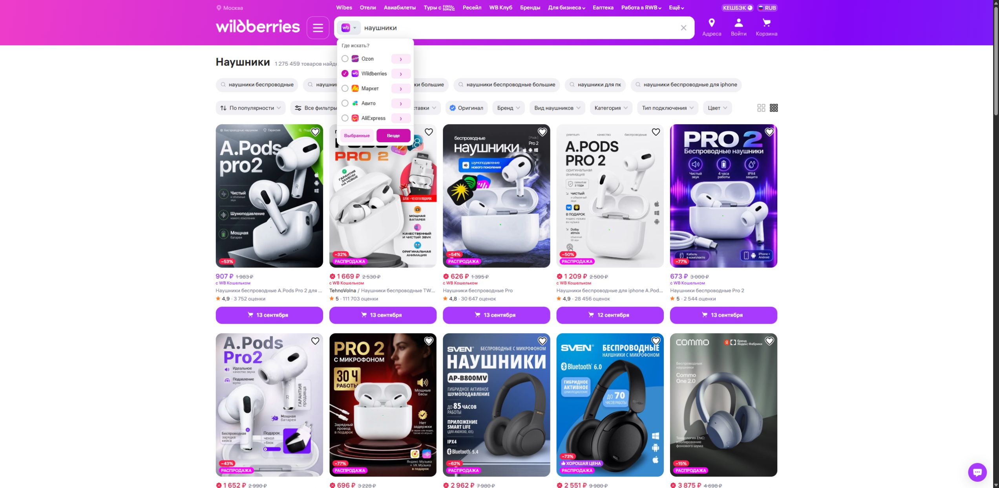
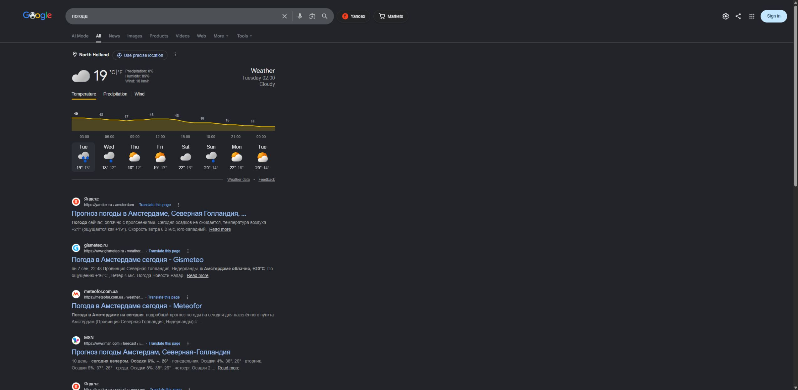
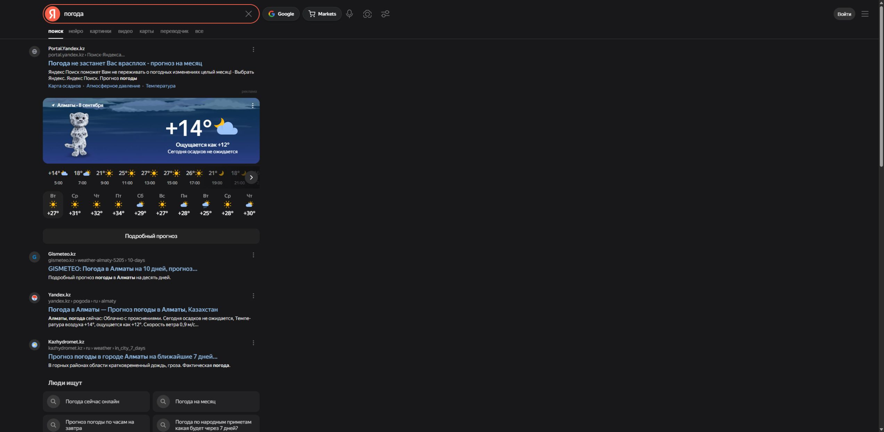

# Advanced Russian Tampermonkey Scripts

Коллекция независимых userscript-скриптов для поиска в русскоязычном интернете: переключение между Google и Яндексом в один клик и поиск товара сразу по нескольким маркетплейсам.

[](LICENSE)
[](#скрипты)
[](#шаг-1-установите-tampermonkey)

> Скрипты работают только вместе с менеджером userscript — [Tampermonkey](https://www.tampermonkey.net/). Каждый скрипт ставится отдельно, всю коллекцию ставить не нужно.

## Содержание

- [Скрипты](#скрипты)
- [Установка для новичка](#установка-для-новичка)
- [Обновление и удаление](#обновление-и-удаление)
- [Если скрипт не работает](#если-скрипт-не-работает)
- [Добавление новых скриптов](#добавление-новых-скриптов)
- [Безопасность](#безопасность)
- [Лицензия](#лицензия)

## Скрипты

| Скрипт | Коротко | Сайты | Версия |
| --- | --- | --- | --- |
| [1. Marketplace Cross Search](#1-marketplace-cross-search) | Один запрос — несколько маркетплейсов | Ozon, Wildberries, Яндекс Маркет, Авито, AliExpress | 1.0.6 |
| [2. Google → Yandex Search Button](#2-google--yandex-search-button) | Кнопки **Yandex** и **Markets** в Google | Google, 58 региональных доменов | 1.1.1 |
| [3. Yandex → Google Search Button](#3-yandex--google-search-button) | Кнопки **Google** и **Markets** в Яндексе | Яндекс, 13 доменов, и Дзен | 1.1.1 |

### 1. Marketplace Cross Search

> Поиск по нескольким маркетплейсам из одной строки поиска.

[](https://raw.githubusercontent.com/wyrtensi/advanced-russian-tampermonkey-scripts/main/scripts/marketplace-cross-search/marketplace-cross-search.user.js)



**Что делает:** добавляет в строку поиска маркетплейса меню выбора площадок. Отметьте несколько маркетплейсов и запустите поиск по ним разом или сразу везде — результаты откроются в новых вкладках. Стрелка справа открывает одну выбранную площадку.

**Где работает:** Ozon, Wildberries, Яндекс Маркет, Авито и AliExpress.

**Как пользоваться:** откройте любой из этих маркетплейсов, введите запрос, раскройте значок площадки в строке поиска и отметьте, где искать.

---

### 2. Google → Yandex Search Button

> Быстрый переход из поиска Google в Яндекс и на маркетплейсы.

[](https://raw.githubusercontent.com/wyrtensi/advanced-russian-tampermonkey-scripts/main/scripts/google-to-yandex/google-to-yandex.user.js)



**Что делает:** добавляет рядом со строкой поиска кнопки **Yandex** и **Markets**. Первая открывает тот же запрос в Яндексе, вторая — в Ozon, Wildberries и Яндекс Маркете.

**Где работает:** страницы поиска Google на 58 региональных доменах — `google.com`, `google.ru`, `google.co.uk`, `google.de` и других.

<details>
<summary>Полный список доменов Google</summary>

```
google.com     google.ru       google.ua      google.by      google.kz
google.uz      google.kg       google.tj      google.tm      google.az
google.ge      google.am       google.md      google.co.uk   google.de
google.fr      google.es       google.it      google.pt      google.nl
google.be      google.ch       google.at      google.pl      google.cz
google.sk      google.hu       google.ro      google.bg      google.si
google.hr      google.rs       google.ba      google.me      google.mk
google.lv      google.lt       google.ee      google.se      google.no
google.dk      google.fi       google.gr      google.ca      google.com.mx
google.com.br  google.com.ar   google.com.au  google.co.jp   google.com.tw
google.co.in   google.com.pk   google.com.tr  google.com.sa  google.ae
google.co.za   google.com.ng   google.com.eg
```

Актуальный список всегда лежит в строках `@match` установленного скрипта.

</details>

**Как пользоваться:** выполните поиск в Google и нажмите нужную кнопку. Для быстрого перехода в Яндекс есть горячая клавиша `Alt+Y`.

---

### 3. Yandex → Google Search Button

> Быстрый переход из поиска Яндекса в Google и на маркетплейсы.

[](https://raw.githubusercontent.com/wyrtensi/advanced-russian-tampermonkey-scripts/main/scripts/yandex-to-google/yandex-to-google.user.js)



**Что делает:** добавляет рядом со строкой поиска кнопки **Google** и **Markets**. Первая открывает тот же запрос в Google, вторая — в Ozon, Wildberries и Яндекс Маркете.

**Где работает:** поиск Яндекса на доменах `yandex.ru`, `yandex.com`, `yandex.by`, `yandex.kz`, `yandex.uz`, `yandex.tm`, `yandex.tj`, `yandex.az`, `yandex.fr`, `yandex.ee`, `yandex.lt`, `yandex.lv`, `yandex.md`, а также `dzen.ru`.

**Как пользоваться:** выполните поиск в Яндексе и нажмите нужную кнопку. Для быстрого перехода в Google есть горячая клавиша `Alt+G`.

## Установка для новичка

Три шага: расширение, разрешение на userscript, сам скрипт.

### Шаг 1. Установите Tampermonkey

| Браузер | Страница расширения | Что нажать |
| --- | --- | --- |
| Chrome | [Chrome Web Store](https://chromewebstore.google.com/detail/tampermonkey/dhdgffkkebhmkfjojejmpbldmpobfkfo) | **Установить** / **Добавить в Chrome** |
| Edge | [Microsoft Edge Add-ons](https://microsoftedge.microsoft.com/addons/detail/tampermonkey/iikmkjmpaadaobahmlepeloendndfphd) | **Получить** |

Перед подтверждением прочитайте список разрешений расширения и соглашайтесь, только если он вас устраивает.

### Шаг 2. Разрешите запуск userscript

В свежих браузерах на Chromium Tampermonkey просит дополнительное разрешение. Откройте страницу расширений (`chrome://extensions` в Chrome или `edge://extensions` в Edge), найдите Tampermonkey и зайдите в его сведения.

- Есть переключатель **Разрешить пользовательские скрипты** / **Allow User Scripts** — включите его.
- Переключателя нет — включите **Режим разработчика** / **Developer mode** на странице расширений.

Достаточно одного из двух вариантов. Пояснения с картинками — в [инструкции Tampermonkey](https://www.tampermonkey.net/faq.php?locale=ru&q=Q209).

### Шаг 3. Установите скрипт

1. Нажмите зелёную кнопку **Установить** у нужного скрипта выше. Ссылка GitHub Raw с окончанием `.user.js` открывает страницу установки Tampermonkey.
2. Проверьте название скрипта и список сайтов в строках `@match` — это те страницы, где скрипт сможет работать.
3. Нажмите **Установить** в Tampermonkey.
4. Откройте меню Tampermonkey и убедитесь, что скрипт появился в списке и включён.
5. Откройте поддерживаемый сайт или обновите уже открытую вкладку — рядом со строкой поиска появится новый элемент.

Подробнее о распознавании ссылок `.user.js` и GitHub Raw — в [инструкции Tampermonkey](https://www.tampermonkey.net/faq.php?locale=ru&q=Q102).

## Обновление и удаление

Всё делается в **Панели управления** Tampermonkey.

| Задача | Действие |
| --- | --- |
| Обновить | **Проверить обновления скриптов** или ручная проверка в настройках скрипта |
| Временно выключить | Переключатель рядом со скриптом в списке |
| Удалить | Открыть скрипт в панели управления и выбрать удаление |

Поля `@updateURL` и `@downloadURL` указывают на те же GitHub Raw-ссылки, поэтому автоматическая проверка забирает новую версию прямо из этого репозитория. Скрипты независимы: выключение или удаление одного не влияет на остальные.

## Если скрипт не работает

1. Проверьте, что включены и Tampermonkey, и сам скрипт.
2. Обновите страницу после установки или обновления скрипта.
3. Убедитесь, что открыт поддерживаемый домен из описания выше.
4. Проверьте разрешение **Разрешить пользовательские скрипты** либо **Режим разработчика** из [шага 2](#шаг-2-разрешите-запуск-userscript).
5. Проверьте в настройках расширения, разрешён ли Tampermonkey доступ к текущему сайту.
6. Сайт изменил вёрстку и кнопки пропали — заведите [issue](https://github.com/wyrtensi/advanced-russian-tampermonkey-scripts/issues) с браузером, адресом страницы и названием скрипта. Персональные данные и снимки приватных страниц прикладывать не нужно.

## Добавление новых скриптов

Каждый userscript живёт в своей папке `scripts/<имя>/<имя>.user.js`. Новому скрипту нужны:

- корректные `@match`, `@homepageURL`, `@supportURL`, `@downloadURL` и `@updateURL`;
- отдельный раздел в README с прямой ссылкой установки;
- скриншот реальной страницы в `docs/images/`.

Независимые возможности не объединяются в общий скрипт без необходимости. Проверка репозитория запускается командой `node tests/verify-repository.mjs`.

## Безопасность

Userscript выполняется на страницах из своих метаданных и может менять их интерфейс. Перед установкой прочитайте исходный код, список `@match`, запрошенные возможности `@grant` и внешние ресурсы `@resource`. Ставьте только нужные скрипты и только из источника, который понимаете.

- `Marketplace Cross Search` открывает выбранные площадки в новых вкладках и подгружает логотипы маркетплейсов как ресурсы Tampermonkey.
- Два скрипта-переключателя открывают поисковые страницы Google, Яндекса и маркетплейсов.

## Лицензия

[MIT](LICENSE).
